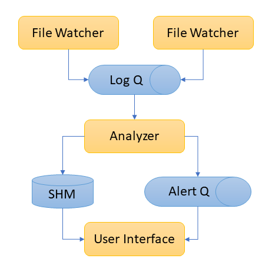

HTTP Log Monitor
================


This program monitors multiple HTTP access log files and show the following information in its text-based user interface:
- Traffic in Logs Per Second (LPS), over a time window of 3 lengths
  - 10 seconds
  - 2 minutes
  - its lifetime, since the application start
- Status
  - Clock shows the time now
  - Alert ON/OFF indicator. It turns on when the traffic for the past 2 minutes exceeds a certain number (10 by default) on lifetime average. It will return to OFF when the traffic drops with a certain threshold
- Popular Sections, listing section according to how many accesses it received during the last 10 seconds, in descending order
- Top Consumer Hosts, listing the hosts getting the most bytes of data in the responses
- List of most recent alert events: when alert has been triggered because of high traffic, when the alert went off as traffic drops back to normal.

Repositories:
- [Bitbucket](https://bitbucket.org/raptorsun/http_log_monitor/src/master/)
- [Github](https://github.com/raptorsun/http_log_monitor)


How to Use
==========

Install
-------
The code depends on [npyscreen](https://npyscreen.readthedocs.io/) module to run. We need to install npyscreen by ``pip install npyscreen`` or using the requirement.txt ``pip install -r requirements.txt``
npyscreen requires ncurses library. This program has to execute on Linux/OS X/Windows with Linux Subsystem.


monitor.py
----------
Following HTTP access log files, it shows statistics and raise alert when traffic increases too fast.

```
monitor.py [-h] -s access_1.log [-s access_2.log] [-l 10]
    -s --source     HTTP access log,
                    multiple log files can be passed by adding "-s log1 -s log2"
    -t --threshold  Threshold in Access Per Second to trigger alarm when 2 minute
                    average is above the lifetime average of this threshold. Default is 10.
```
Once the monitor is running, a TUI will pop up presenting statistics on access log in 5 boxes:
- Traffic: LPS in 3 time-windows: 10s, 2m, lifetime, refreshed every 10 seconds.
- Status: Current Time and Alert Status. Alerts are shown in different colors for ON and OFF.
- Popular Sections: List of sections most accessed during the past 10 seconds
- Top Bandwidth Consumers: List of remotehosts requested the most bytes of data during since the beginning.
- Alerts: List of most recent alerts, if average traffic over 2 minutes is high above the life time average exceeding the threshold, the alerts will continue pop up in this list. When traffic return under the threshold, only one alert off message will show. The list is rolling up in the same way "tail -f" does.


Swtich box: Use tab and alt-tab to switch from one box to another.
Browsing list: Use up and down arrow keys to browse a list (Popular Sections, Top Bandwidth Consumers)
Quit monitor: switch to OK button at the bottom and press enter, or press Esc key at any moment.

Statistics starts to show from the 10th second. It is normal there is no information shown withing the 10 seconds just after launching the monitor.


traffic_generator.py
--------------------
This traffic generator will append to access log file either random generated line or copying line by line from existing access log file, with a speed regulator.

```
traffic_generator.py [-s access_src.log] -d access_dest.log -l 10
Write logs from source to destination file with a rate
    -s source file       if specified, copy line by line from this file and append it to the destination file
    -d destination file  generated logs are appended to this file
    -l lines per second  number of lines output each second
```

test_monitor.py
---------------
This is a test for alert mechanism in monitor.py. It has its own log queue producer process to feed Analyzer with a moderate pace at the beginning and then switch to a very high rate later on, with the intention of generating a high-traffic alert. Once the alert is on, it drops the output traffic so that the alert will goes off. Then it will check the alert off message is well received through the alert queue.
```
python test_monitor.py
```

It will show test results in the format below. The test takes about 30 seconds on a PC with Core i7 8650U.
```
(pyenv_monitor) ➜  http_log_monitor git:(master) ✗ time python test_monitor.py
test_alert_on_and_off (__main__.MonitorTest) ... ok

----------------------------------------------------------------------
Ran 1 test in 32.335s

OK
python test_monitor.py  0.52s user 0.59s system 3% cpu 32.672 total
```

Design
======

Architecture
------------
The monitor is a multiprocess application, exchanging information through queues and shared memory.
There are 3 type of processes:
1. File Wather
2. Analyzer
3. User Inerface



The File Watchers read new line from monitored files, parse the log line and put the extracted information as log items into a message queue dedicated to log influx.

The Analyzer consume log items and update the memory segment shared with User Interface. When Analyzer finds out the 2 minutes average LPS is higher than the lifetime average LPS plus a threshold, the Analyzer send an alert item into the alert message queue. Which will be consumed by the User Interface.

The User Interface present a text based UI in the console, periodically update the widgets with statistics information in the shared memory. If there is message in the alert queue,  the alert status will change accordingly and shows alert messages in the UI.

Data Structure
--------------

The Analyzer is required to calculate average traffic during a sliding time windows of 2 minutes and the average traffic every 10 seconds during these 10 seconds. This is similar to filming a movie. We can consider the statistics collected every 10 seconds as a frame and the sliding time windows of 2 minutes as a scene. A scene is composed of multiple frames in a movie, so is the 2 minute statistics composed as an aggregation of 12 times of statistics over 10 seconds.

Thus we use a circular buffer to keep every frame containing 10s of statistics in the scene of 2 minutes. Thus it contains 12 items in the buffer (2min / 10s = 12). For calculating average traffic over 2 minutes, we just need to sum up the access counter of each item in the buffer and then divided by duration of 2 minutes. Any metric can be calculated this way, as long as it is an [aggregation function](https://en.wikipedia.org/wiki/Aggregate_function).

Information sharing between UI and Analyzer is done through a shared dictionary. No locking mechanism is required since UI is a pure reader and Analyzer is the only process writing into this dictionary.

Log are fed to Analyzer via FIFO message queue, so are alerts fed to UI.

Evolution
=========

File Watcher
------------
Access logs are usually rotated when reaching certain size in production environment. We can make File Watcher support rotated log file and temporary missing files.

Parser assumes each line conforms with the [w3c-format](https://www.w3.org/Daemon/User/Config/Logging.html). We can add error handling for corrupted logs.

Analyzer
--------
Current implementation of Analyzer is not parallelizable. In face of very high traffic, Analyzer may not be able to catch up. We can make it scalable by:
1. allocating dedicated statistics buffer for each Analyzer, keeping counters only
2. adding a merger process merging data from individual Analyzer and put it into memory shared with UI

In this version all data are ephemeral, we can add a analytics recorder keeping calculated metrics in perisitent storage (disk, DB) for later consultation.

User Interface
--------------
Daemonize the Analyzer and Filewatcher, make the UI a seperate application to launch when we need consult statistics. 

Most widgets use the size defined at start time for the rest of their life. We can make it auto resize when we modify the size of terminal during execution.

Add meaningful colors on metrics for easier reading.

Alert
-----
Send email to concerned people when alert is on.

Add beep when alert is on.
